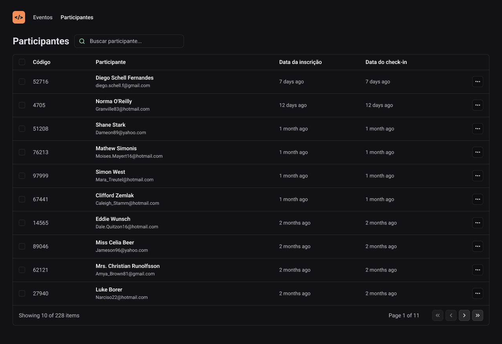

<h1 align="center">Pass.In</h1>

<p align="center">Projeto desenvolvido durante a NLW Unite da Rocketseat na trilha React.</p>

<p align="center">
  
</p>

<br>

## Tópicos
- [Imagem do projeto](#img)
- [Sobre o projeto](#sobre)
- [Tecnologias utilizadas](#tec)
- [Executando o projeto](#exec)
- [Status do projeto](#status)
- [Licença](#license)

<br>

<h2 id="img">📸 Imagem do projeto</h2>



<br>

<h2 id="sobre">📖 Sobre o projeto</h2>

<p align="justify">Esta é uma aplicação para gestão de eventos. A parte da web consiste em um dashboard que permite o controle de participantes.</p>

<br>

<h2 id="tec">🚀 Tecnologias utilizadas</h2>

* React
* Tailwind CSS
* TypeScript
* Git e Github

<br>

<h2 id="exec">📋 Executando o projeto</h2>

<h3>Pré-requisito</h3>

* [NodeJS LTS](https://nodejs.org/en/)

<h3>Executando a API</h3>

```bash
# Acesse o repositório da API
https://github.com/rocketseat-education/nlw-unite-nodejs

# Clone o repositório
$ git clone https://github.com/rocketseat-education/nlw-unite-nodejs.git

# Acesse a pasta do projeto no terminal/cmd
$ cd nlw-unite-nodejs

# Instale as dependências do projeto
$ npm install ou npm i

# Crie na raiz do projeto um arquivo .env
# Coloque nesse arquivo criado o código abaixo
DATABASE_URL="file:dev.db"

# Execute as migrações
$ npm run db:migrate

# Faça o build
$ npm run build

# Execute a API
$ npm start
```
> A API será executada na porta 3333

<br>

<h3>Executando o projeto na web</h3>

```bash
# Clone este repositório
$ git clone https://github.com/Fel1324/NLW-Unite-React.git

# Acesse a pasta do projeto no terminal/cmd
$ cd NLW-Unite-React

# Instale as dependências do projeto
$ npm install ou npm i

# Execute o projeto
$ npm run dev
```
> O servidor irá iniciar em -> http://localhost:5173

<br>

<h2 id="status">🚧 Status do projeto</h2>

Projeto finalizado ✅

<br>

<h2 id="license">📝 Licença</h2

Esse projeto está sob a licença MIT.

---

Feito com ♥ by Rocketseat :wave: [Participe da nossa comunidade!](https://discord.gg/rocketseat)
